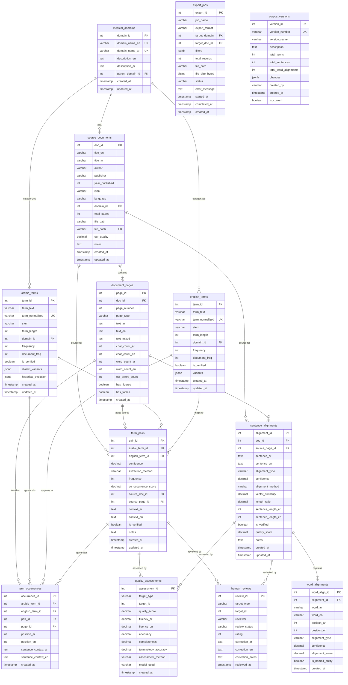

# BilingualExtractor Database Schema - ER Diagram (Mermaid)

## Entity Relationship Diagram

```mermaid
erDiagram
    medical_domains {
        int domain_id PK
        varchar domain_name_en UK
        varchar domain_name_ar UK
        text description_en
        text description_ar
        int parent_domain_id FK
        timestamp created_at
        timestamp updated_at
    }

    source_documents {
        int doc_id PK
        varchar title_en
        varchar title_ar
        varchar author
        varchar publisher
        int year_published
        varchar isbn
        varchar language
        int domain_id FK
        int total_pages
        varchar file_path
        varchar file_hash UK
        decimal ocr_quality
        text notes
        timestamp created_at
        timestamp updated_at
    }

    document_pages {
        int page_id PK
        int doc_id FK
        int page_number
        varchar page_type
        text text_ar
        text text_en
        text text_mixed
        int char_count_ar
        int char_count_en
        int word_count_ar
        int word_count_en
        int ocr_errors_count
        boolean has_figures
        boolean has_tables
        timestamp created_at
    }

    arabic_terms {
        int term_id PK
        varchar term_text
        varchar term_normalized UK
        varchar stem
        int term_length
        int domain_id FK
        int frequency
        int document_freq
        boolean is_verified
        jsonb dialect_variants
        jsonb historical_evolution
        timestamp created_at
        timestamp updated_at
    }

    english_terms {
        int term_id PK
        varchar term_text
        varchar term_normalized UK
        varchar stem
        int term_length
        int domain_id FK
        int frequency
        int document_freq
        boolean is_verified
        jsonb variants
        timestamp created_at
        timestamp updated_at
    }

    term_pairs {
        int pair_id PK
        int arabic_term_id FK
        int english_term_id FK
        decimal confidence
        varchar extraction_method
        int frequency
        decimal co_occurrence_score
        int source_doc_id FK
        int source_page_id FK
        text context_ar
        text context_en
        boolean is_verified
        text notes
        timestamp created_at
        timestamp updated_at
    }

    term_occurrences {
        int occurrence_id PK
        int arabic_term_id FK
        int english_term_id FK
        int pair_id FK
        int page_id FK
        int position_ar
        int position_en
        text sentence_context_ar
        text sentence_context_en
        timestamp created_at
    }

    sentence_alignments {
        int alignment_id PK
        int doc_id FK
        int source_page_id FK
        text sentence_ar
        text sentence_en
        varchar alignment_type
        decimal confidence
        varchar alignment_method
        decimal vector_similarity
        decimal length_ratio
        int sentence_length_ar
        int sentence_length_en
        boolean is_verified
        decimal quality_score
        text notes
        timestamp created_at
        timestamp updated_at
    }

    word_alignments {
        int word_align_id PK
        int alignment_id FK
        varchar word_ar
        varchar word_en
        int position_ar
        int position_en
        varchar alignment_type
        decimal confidence
        decimal alignment_score
        boolean is_named_entity
        timestamp created_at
    }

    quality_assessments {
        int assessment_id PK
        varchar target_type
        int target_id
        decimal quality_score
        decimal fluency_ar
        decimal fluency_en
        decimal adequacy
        decimal completeness
        decimal terminology_accuracy
        varchar assessment_method
        varchar model_used
        timestamp created_at
    }

    human_reviews {
        int review_id PK
        varchar target_type
        int target_id
        varchar reviewer
        varchar review_status
        int rating
        text correction_ar
        text correction_en
        text correction_notes
        timestamp reviewed_at
    }

    export_jobs {
        int export_id PK
        varchar job_name
        varchar export_format
        int target_domain FK
        int target_doc_id FK
        jsonb filters
        int total_records
        varchar file_path
        bigint file_size_bytes
        varchar status
        text error_message
        timestamp started_at
        timestamp completed_at
        timestamp created_at
    }

    corpus_versions {
        int version_id PK
        varchar version_number UK
        varchar version_name
        text description
        int total_terms
        int total_sentences
        int total_word_alignments
        jsonb changes
        varchar created_by
        timestamp created_at
        boolean is_current
    }

    medical_domains ||--o{ source_documents : "has"
    medical_domains ||--o{ arabic_terms : "categorizes"
    medical_domains ||--o{ english_terms : "categorizes"
    source_documents ||--|{ document_pages : "contains"
    source_documents ||--o{ term_pairs : "source for"
    source_documents ||--o{ sentence_alignments : "source for"
    document_pages ||--o{ term_pairs : "page source"
    document_pages ||--o{ term_occurrences : "found on"
    document_pages ||--o{ sentence_alignments : "page source"
    arabic_terms ||--o{ term_pairs : "maps to"
    english_terms ||--o{ term_pairs : "maps to"
    arabic_terms ||--o{ term_occurrences : "appears in"
    english_terms ||--o{ term_occurrences : "appears in"
    term_pairs ||--o{ term_occurrences : "generates"
    sentence_alignments ||--|{ word_alignments : "contains"
    term_pairs ||--o{ quality_assessments : "assessed by"
    sentence_alignments ||--o{ quality_assessments : "assessed by"
    term_pairs ||--o{ human_reviews : "reviewed by"
    sentence_alignments ||--o{ human_reviews : "reviewed by"
```
